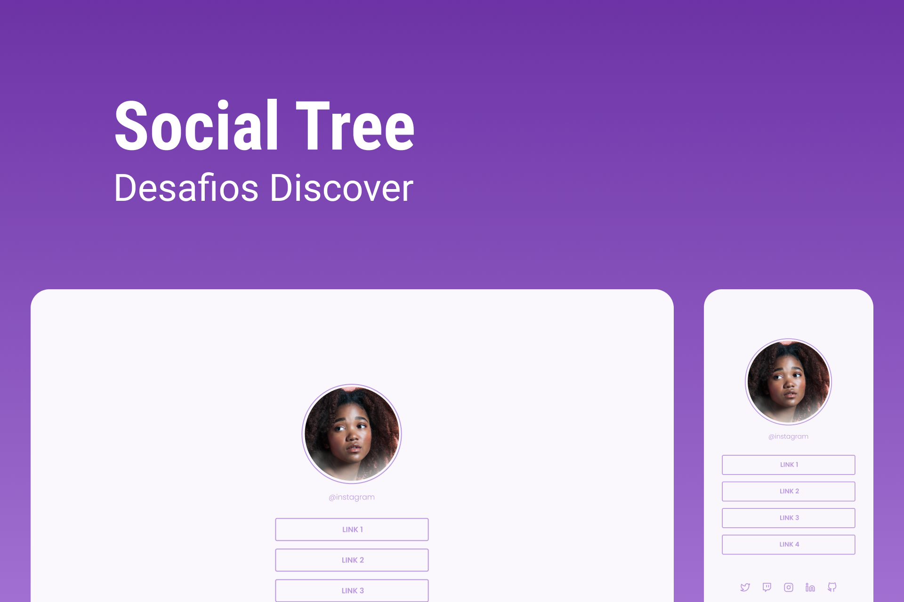

<h1 align="center"> Social Tree </h1>

<p align="center">
 Projeto promovido pela Rocketseat para ensino de tecnologias WEB. É uma pagina princial no qual reunem links que podem ser usados em perfis de redes sociais. <br/>
</p>

<p align="center">
  <a href="#-tecnologias">Tecnologias</a>&nbsp;&nbsp;&nbsp;|&nbsp;&nbsp;&nbsp;
  <a href="#-funcionalidades">Funcionalidades</a>&nbsp;&nbsp;&nbsp;|&nbsp;&nbsp;&nbsp;
  <a href="#-layout">Layout</a>&nbsp;&nbsp;&nbsp;|&nbsp;&nbsp;&nbsp;
  <a href="#memo-licença">Licença</a>
</p>

<p align="center">
  
</p>

<br>

<p align="center">
  
</p>

## 🚀 Tecnologias

Esse projeto foi desenvolvido com as seguintes tecnologias:

- HTML
- CSS
- JavaScript
- DOM
- React
- React DOM
- Testing Library
- React Scripts
- Web Vitals
- Node
- NPM
- Google Fonts

## 💻 Funcionalidades:

- [x] Redirecionamento para sites externos

## 🔖 Layout

Você pode visualizar o layout do projeto através [DESSE LINK](https://www.figma.com/file/zz8QxNrvfZxVr6xxQeQ8yj/DD-%2F-Social-links-(Copy)?type=design&node-id=0-1&t=lWT3WX0J3cPYdqPf-0). É necessário ter conta no [Figma](https://figma.com) para acessá-lo.

## 🚀 Instalação e uso

```bash
# Clone o repositório
git clone https://github.com/Alexandre-Schmidt/social-tree.git

# Acesse a pasta do projeto
cd social-tree

# Instale as dependências
npm install

# Execute a aplicação
npm run dev

# O servidor inciará na porta:3000 - acesse http://localhost:3000
```

## :memo: Licença

Esse projeto está sob a licença MIT.

---

:wave: Confira meu perfil profissional no [LinkedIn](https://www.linkedin.com/in/alexandreborgesschmidt/)
